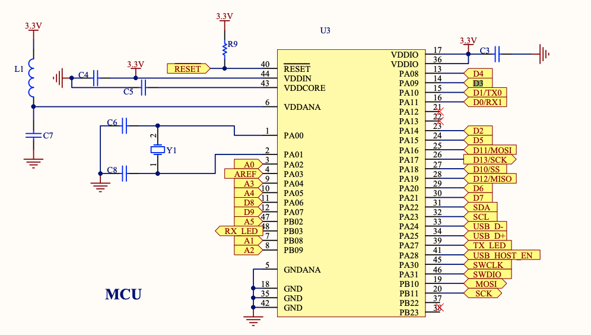

# Testing out TLC with SAMD21

## Test setup

- board: https://robotdyn.com/samd21-m0-mini.html
- variant: https://github.com/sparkfun/Arduino_Boards/blob/master/sparkfun/samd/variants/SparkFun_SAMD_Mini/variant.cpp
- TLC module: https://www.adafruit.com/product/1455

## MCU pinout

